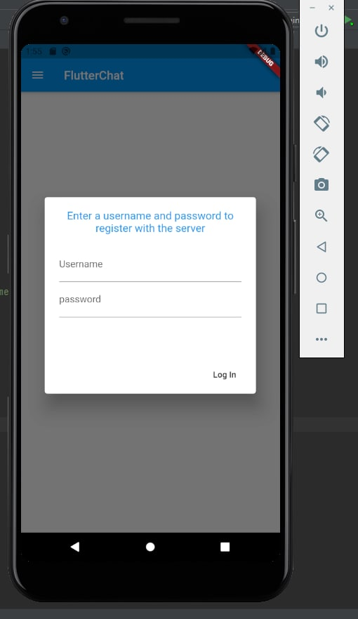
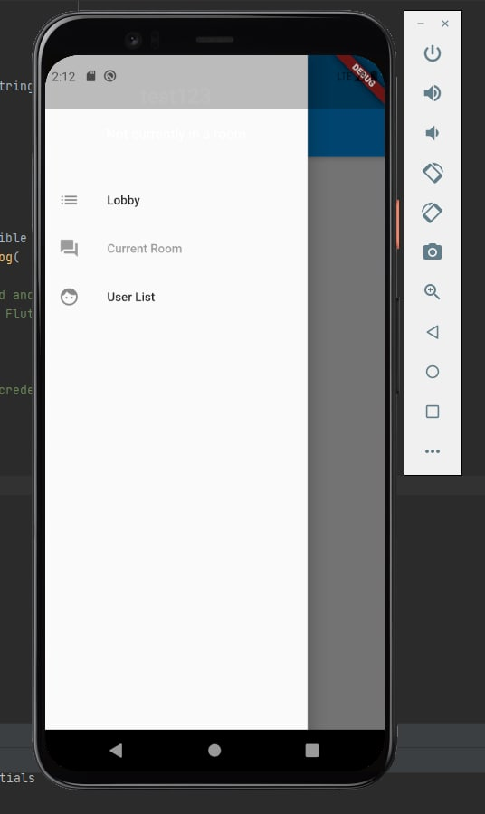
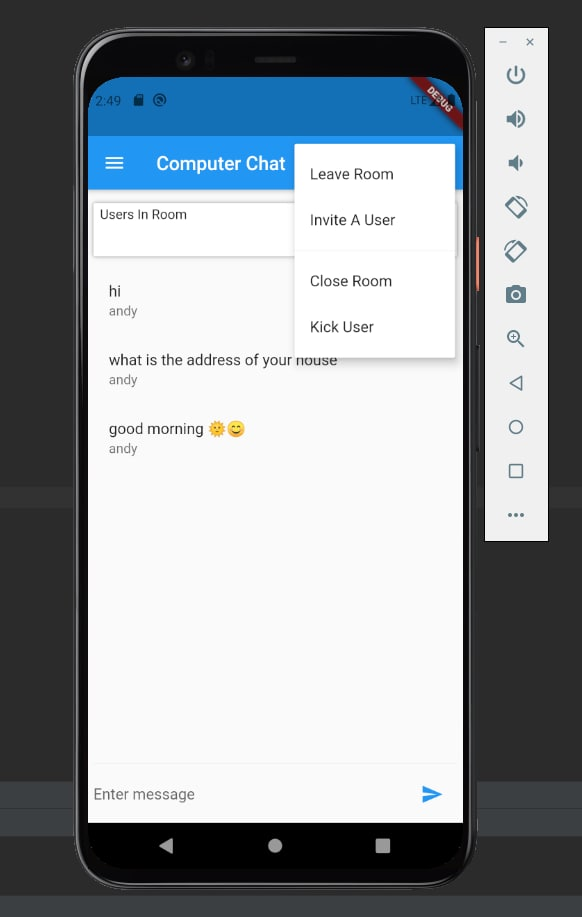
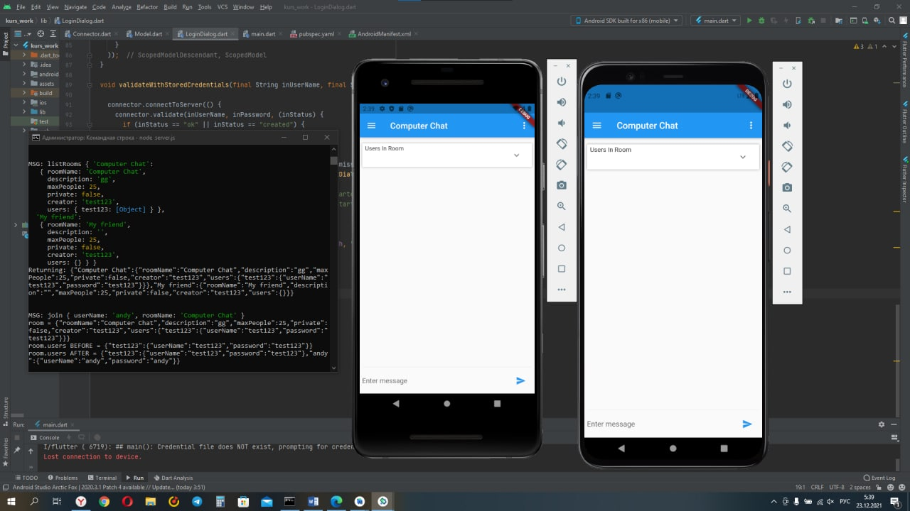
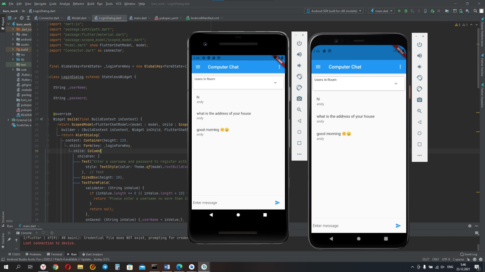

# kurs_work

What app can do ?

+ sending messages
+ create individual chats
+ creata group chats
+ register users
+ user authentication
+ sending files
+ administration of group chats

How it's works?

The Dart language and the Flutter framework were chosen as the main technology for writing app. To implement a web server, the choice fell on NodeJS and Socket.io these technologies combine many functions: authentication, real-time database, file storage, etc.

Screenshots

## Getting Started

This project is a starting point for a Flutter application.

A few resources to get you started if this is your first Flutter project:

- [Lab: Write your first Flutter app](https://flutter.dev/docs/get-started/codelab)
- [Cookbook: Useful Flutter samples](https://flutter.dev/docs/cookbook)

For help getting started with Flutter, view our
[online documentation](https://flutter.dev/docs), which offers tutorials,
samples, guidance on mobile development, and a full API reference.
